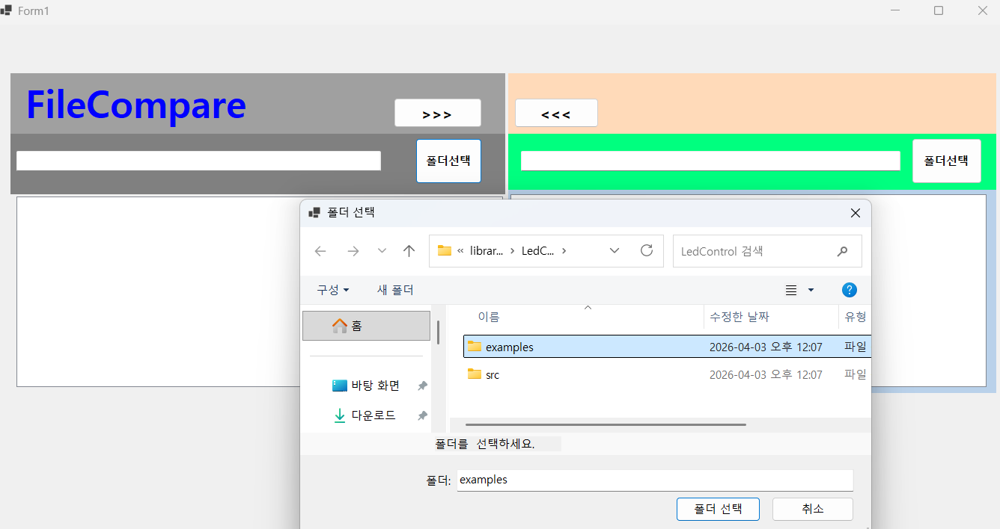
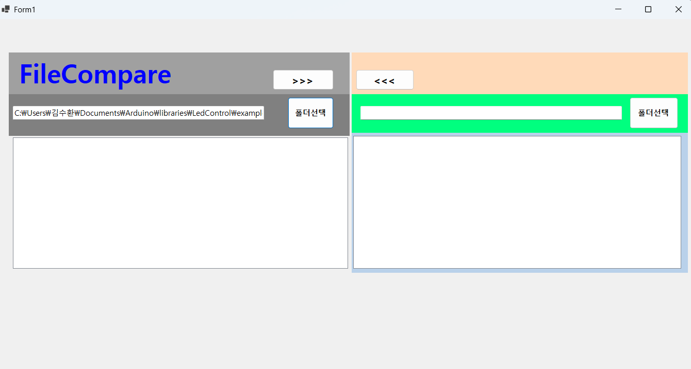
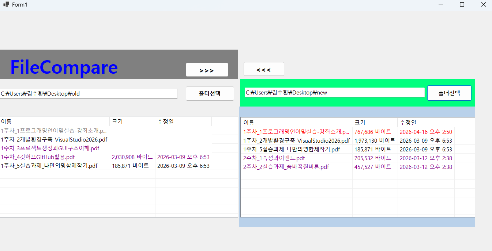

# (C# 코딩) 에코 메신저 ## 개요
- C# 프로그래밍 학습

- 1줄 소개: 컴퓨터 내 파일을 찾아내고 비교하여 상호 복사가 가능한 툴
- 사용한 플랫폼: 
- C#, .NET Windows Forms, Visual Studio, GitHub
- 사용한 컨트롤:

## 실행 화면 (과제1)
- 코드의 실행 스크린샷과 구현 내용 설명

- 구현한 내용 (위 그림 참조)
- UI 구성 : textbox, splitcontainer,panel,label,button
- splitcontainer로 좌측과 우측의 파일들을 비교하기 위한 구분
- panel을 배치하여 정확하게 3개의 구역으로 나눈 후 각각에 맞는 로직 배치
- panel을 배치할 때 dock을 사용하여 정확하게 배치 가능
- padding으로 여백을 남겨 꽉 찬 느낌에서 벗어나게 디자인
- ancher을 사용하여 창을 키우거나 줄였을 때 중요 버튼이 사라지지 않게 배치
- 파일 찾기라는 버튼을 누를 시 컴퓨터 내 파일을 선택하여 txtbox에 나타나게 구현

## 실행 화면 (과제2)
- 코드의 실행 스크린샷과 구현 내용 설명

- 구현한 내용 (위 그림 참조)
- 파일들을 가져오면 아래 list 형식으로 나타나게 되어 열린 두 파일을 비교한다
- 이름이 같을 경우 최근 파일은 빨간색 오래된 파일은 회색으로 표시하고 단독 파일은 보라색으로 표시한다